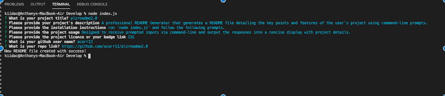

# plzreadme2.0

## Description
A professional README Generator that generates a README file detailing the key points and features of the user's project using command-line prompts.

## Links
[Source Code](https://github.com/acarr13/plzreadme2.0)

## Usage
Designed to receive prompted inputs via command-line and output the resposnes into a concise display with project details.

## Screenshots
Below is a screenshot of the project:

